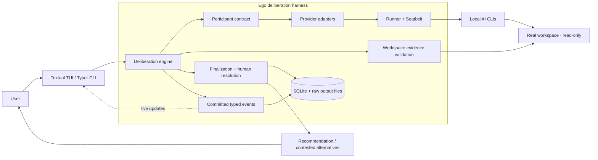

# Ego CLI

[](https://github.com/rrmarto/ego/actions/workflows/pages.yml)

Ego is a local decision-support harness that asks multiple AI CLIs to inspect the
same workspace, challenge each other's conclusions, and produce an auditable
recommendation. It provides a full-screen terminal interface for interactive
work and stable commands for scripts and one-off checks.

Ego does **not** modify the inspected workspace or implement the recommendation.
When participants disagree materially, it preserves their alternatives and asks
the user to choose, write a different conclusion, defer, or reject the result.

**[Open the interactive architecture map](https://rrmarto.github.io/ego/)**

## Current scope

Ego v0.1.0:

- coordinates locally installed Codex, Claude, Gemini, and Copilot CLIs;
- reads the real workspace under a mandatory macOS Seatbelt boundary;
- runs a five-phase deliberation protocol instead of selecting a result by vote;
- validates cited paths, line ranges, and file fragments against the workspace;
- persists runs, normalized model responses, decisions, and human resolutions;
- reports provider usage when a CLI exposes token or cost information;
- supports interactive inspection through a Textual TUI and JSON output through
  the command line.

This is an early release. The stored decision format is append-only, but the UI
and installation process may still change.

## Requirements

- macOS. Ego v1 relies on `/usr/bin/sandbox-exec` and refuses to run a
  participant if the read-only boundary cannot be verified.
- Python 3.14 or newer.
- [`uv`](https://docs.astral.sh/uv/) for the installation commands below.
- At least one supported AI CLI installed and authenticated. Participants that
  are missing, incompatible, or unsafe are excluded and reported by `doctor`.

Ego invokes existing CLI sessions. It does not configure provider accounts or
call provider HTTP APIs directly.

## Install

Install the current version directly from GitHub:

```bash
uv tool install "git+https://github.com/rrmarto/ego.git"
ego --version
ego doctor
```

For development, use a local clone:

```bash
git clone https://github.com/rrmarto/ego.git
cd ego
uv sync --dev
uv run ego doctor
```

An editable tool installation keeps the global `ego` command linked to the
local source tree:

```bash
uv tool install --force --editable .
```

## Quick start

Open the interactive interface from the workspace you want Ego to inspect:

```bash
cd /path/to/project
ego
```

Enter a question directly, for example:

```text
Should this project keep its current authentication module boundaries?
```

The TUI shows participant readiness, phase progress, elapsed time, usage data,
expandable normalized responses, the final recommendation, and any action that
still requires a human decision.

Common interactive commands:

| Command | Purpose |
| --- | --- |
| `/help` | Show every interactive command. |
| `/doctor` | Re-run participant and sandbox checks. |
| `/summon codex claude -- <question>` | Use selected participants. |
| `/mode standard\|discussion\|expert` | Change the amount of visible detail. |
| `/runs` and `/inspect <run-id>` | Review previous deliberations. |
| `/decisions` and `/show <decision-id>` | Review persisted decisions. |
| `/choose`, `/decide`, `/defer`, `/reject` | Resolve the current decision. |
| `/exit` | Leave Ego. |

## Command-line usage

The Typer commands remain available for scripts and non-interactive use:

```bash
# Ask every enabled and available participant
ego ask "Should we split this service?" --dir .

# Ask explicitly selected participants
ego summon "Review the caching strategy" --dir . \
  --participant codex --participant claude

# Emit structured output
ego ask "Review this architecture" --dir . --json

# Diagnose adapters, CLI versions, authentication, and sandbox support
ego doctor
ego participants --json

# Inspect recorded work
ego runs
ego inspect <run-id> --mode expert
ego decisions
ego show <decision-id>

# Re-run a decision with new information while preserving its relationship
ego reconsider <decision-id> "The deployment target changed to macOS only"
```

Run `ego --help` or `ego <command> --help` for the complete option reference.

## Deliberation protocol

Every available participant receives the same question and follows the same
protocol:

1. **Independent reasoning** — each participant produces its own structured
   position and cites relevant workspace evidence.
2. **Peer review** — participants challenge claims, missing evidence, and risks
   in the other positions.
3. **Position revision** — each participant updates or explicitly preserves its
   position after the review.
4. **Cross synthesis** — two rotating peers create independent syntheses from
   the revised material.
5. **Reconciliation** — the synthesizers determine whether the results are
   materially equivalent or still contested.

There is no majority vote and no permanently privileged model. Invalid or
insubstantial structured responses receive one corrective attempt; repeated
failures are recorded and the run degrades explicitly.

Citation verification confirms that a referenced path, line range, and content
hash match the inspected workspace. It does not prove that the model interpreted
that source correctly. For this reason, model agreement alone cannot produce
high confidence.

## Human decision loop

A recommendation is stored separately from the user's final action. For a
contested result, accept one of the recorded alternatives or provide a custom
conclusion:

```bash
ego decisions choose <decision-id> 1 --note "Preferred compatibility tradeoff"
ego decisions decide <decision-id> \
  "Keep the current boundary until the migration test is complete"
```

For any decision, the user can also record its operational state:

```bash
ego decisions accept <decision-id> --note "Approved for planning"
ego decisions defer <decision-id> --note "Need runtime evidence"
ego decisions reject <decision-id> --note "Risk is not acceptable"
```

These actions append a new event. They do not rewrite the original model result,
disagreements, or evidence.

## Architecture

The TUI and command-line interface depend on the same application services. The
deliberation engine works through the `Participant` contract, so provider flags,
authentication checks, and output parsing remain inside their adapters.



| Area | Responsibility | Source |
| --- | --- | --- |
| Interfaces | TUI state, timeline, commands, and non-interactive rendering | [`src/ego/tui`](src/ego/tui), [`src/ego/cli.py`](src/ego/cli.py) |
| Deliberation | Phase barriers, failure handling, synthesis, and reconciliation | [`src/ego/deliberation`](src/ego/deliberation) |
| Participants | Provider probing, command construction, structured output, and usage extraction | [`src/ego/participants`](src/ego/participants) |
| Safety boundary | Subprocess limits, reduced environments, and macOS Seatbelt enforcement | [`src/ego/runner.py`](src/ego/runner.py), [`src/ego/sandbox.py`](src/ego/sandbox.py) |
| Workspace | Canonical path resolution and evidence verification | [`src/ego/workspace.py`](src/ego/workspace.py) |
| Observability | Typed lifecycle events published only after persistence | [`src/ego/events.py`](src/ego/events.py) |
| Persistence | SQLite migrations, append-only records, and raw-output retention | [`src/ego/storage`](src/ego/storage) |

Architecture resources:

- **[Interactive system map](https://rrmarto.github.io/ego/)** — navigable view
  from the TUI through the harness, safety boundary, and human decision loop.
- [Architecture contract](docs/architecture.md) — invariants and component
  responsibilities.
- [Architecture Decision Records](docs/decisions) — accepted design decisions
  and their consequences.

## Safety and data handling

Every participant must pass binary, capability, and external Seatbelt checks
before execution. Ego also checks authentication when the provider CLI exposes
a non-invasive status command. The wrapper denies writes to the canonical
workspace path. Native read-only controls remain enabled where they can coexist
with that wrapper.

Codex cannot nest its internal macOS Seatbelt inside Ego's boundary. Its adapter
therefore uses Codex's externally sandboxed mode only for the child process
launched by Ego. That process receives a temporary `CODEX_HOME` with a private
authentication copy, while the external profile protects the workspace and
durable user and system locations. Ego does not modify global Codex settings,
workspace permissions, or macOS policy.

SQLite stores runs, calls, events, decisions, and human resolutions in the
platform application-data directory. Raw provider output may contain workspace
fragments; it is stored separately and removed after 30 days by default. Set
`EGO_DATA_DIR` to use a different data location.

## Configuration

Ego reads `config.toml` from its platform application-data directory. A minimal
example:

```toml
raw_retention_days = 30
output_limit_bytes = 5242880

[participants.codex]
enabled = true
timeout_seconds = 600

[participants.claude]
enabled = true
timeout_seconds = 600

[participants.gemini]
enabled = false

[participants.copilot]
enabled = false
```

Participant-specific binary paths can be set with `binary = "/path/to/cli"`.
Run `ego doctor` after any configuration change.

## Development

Normal tests use synthetic participants and do not require provider credentials
or invoke external AI CLIs:

```bash
uv sync --dev
uv run pytest
uv run ruff check .
uv run mypy
```
